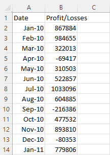
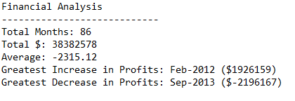
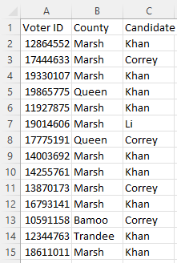
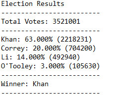

### Summary
There are 2 folders each with a different task that involves extracting specified information from CSV files by utilsing Python.

The purpose of the scripts is to demonstrate the use of for loops, if statments, lists, dictionaries, and functions in Python.

### PyBank

 
 
CSV file contains a column for date (month) and a column for profit/losses.
 

 
 

#### What script does
Iterates over each line in the CSV file and outputs the following:
* Total number of months in the data
* Net profit/loss over the period.
* Average change over the period.
* Month with greatest increase in profits.
* Month with greatest decrease in profits.

#### Output 
The script produces the following output in a .txt file 

  

### PyPoll

  

CSV file contains election data 
 
  

#### What script does
Iterates over each line in the CSV file and outputs the following:
* The total number of votes cast
* A complete list of candidates who received votes
* Percentage of votes each candidate won
* Total number of votes each candidate won
* Winner of the election based on popular vote.

#### Output 
The script produces the following output in a .txt file 

  

  

### Abz Raja
abzraja@gmail.com